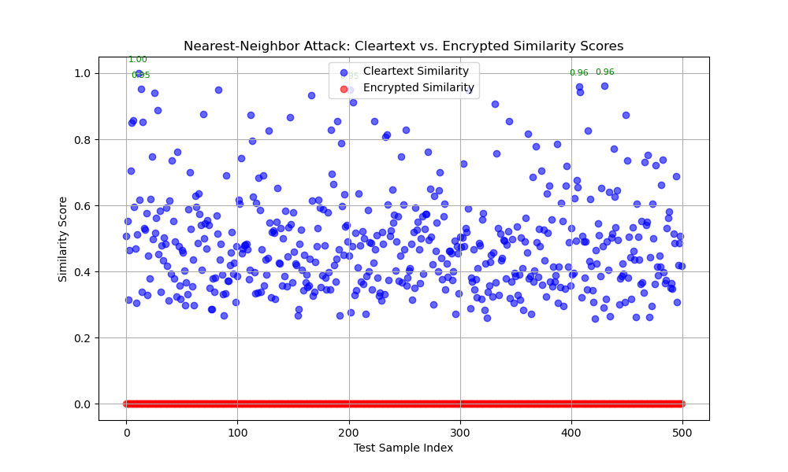

# Privacy-Preserving Biometric Template Protection Using Homomorphic Encryption

---

## **1. Title:**

### **Privacy-Preserving Biometric Template Protection Using Homomorphic Encryption**

## **2. Author Name:**

Orel Razy, ID: XXXX

## **3. Supervised by:**

This project was supervised by Prof. Adi Akavia, Fall 2024

---

## **4. Abstract**

Biometric identification systems have become pervasive across multiple industries, raising critical privacy concerns due to potential data breaches. This project addresses these concerns by implementing privacy-preserving biometric identification through Fully Homomorphic Encryption (FHE) using the GhostFaceNet model and the MS1M-ArcFace dataset. We investigate how the inherent precision limitations of the CKKS encryption scheme impact the accuracy of biometric matching. Our findings show negligible differences between cleartext and encrypted computations, with over 96% accuracy in top-10 matches and compact ciphertext sizes of under 11 MB, demonstrating the feasibility and efficiency of our approach.

---

## **5. Introduction**

### **a. Background**

Biometric identification leverages unique physiological traits, such as facial features, to authenticate individuals. While this technology has revolutionized security and authentication, it also presents significant privacy risks due to potential leaks of sensitive biometric data. Fully Homomorphic Encryption (FHE) addresses these risks by enabling computations directly on encrypted data, preserving confidentiality throughout the computation process.

### **b. Research Goal**

The primary goal of this project is to develop a privacy-preserving biometric identification pipeline that integrates vector-based facial recognition with FHE. Specifically, we evaluate the impact of precision limitations introduced by CKKS encryption on the system's accuracy and runtime performance.
Initially, the project was scoped to investigate only Part A, focusing on evaluating the effect of precision limitations on biometric identification under cleartext data. However, recognizing the potential impact of integrating privacy-preserving computations, we extended our efforts to implement Part B (similarity metric computation over encrypted vectors) and Part C (privacy-preserving biometric identification). The datasets used for Parts A and C differ due to time constraints and the exploratory nature of the later phases.

### **c. Results**

Our implementation of privacy-preserving biometric identification demonstrates that encrypted cosine similarity computations achieve high accuracy, with an average top-10 match percentage of 96.68%. The system efficiently handles the biometric comparison of 10,000 individuals with ciphertext sizes of 10.8 MB. However, the computational overhead of 8622.54 seconds for encrypted similarity indicates room for future optimizations.

### **d. Related Work**

Existing literature on privacy-preserving biometrics explores techniques like secure multiparty computation (SMPC) and FHE. While SMPC offers privacy guarantees, it typically requires significant communication overhead. FHE, on the other hand, allows encrypted computations on cloud servers with minimal interaction. The MS1M-ArcFace dataset and the GhostFaceNet model have been widely adopted in facial recognition studies due to their robustness and state-of-the-art accuracy.

#### **Comparison with Related Work**

**Secure Multiparty Computation (SMPC) in Biometric Identification:**

Bringer et al. (2013) presented a comprehensive overview of applying secure two-party computation techniques to biometric identification systems. Their Work demonstrated that SMPC could effectively preserve privacy during the authentication process by ensuring that biometric data remains confidential between the participating parties. However, the study also highlighted significant communication overhead as a primary limitation, which can impede scalability in large-scale deployments ([Bringer et al., 2013](https://ieeexplore.ieee.org/document/6461629)).

Wu et al. (2023) introduced the concept of tensor triples to enhance the efficiency of multidimensional SMPC protocols. Their approach significantly accelerated the use of privacy-preserving biometric identification protocols, such as FaceNet, by over 1000 times, with reasonable offline costs. This advancement addresses some of the performance bottlenecks associated with traditional SMPC methods ([Wu et al., 2023](https://eprint.iacr.org/2023/1863)).

**Fully Homomorphic Encryption (FHE) in Biometric Identification:**

Sperling et al. (2022) proposed HEFT (Homomorphically Encrypted Fusion of biometric Templates), a non-interactive end-to-end solution for secure fusion and matching biometric templates using FHE. Their method allowed for direct feature concatenation, fusion, and match score computation on encrypted data. While their approach improved verification performance and maintained high accuracy, the computational complexity and runtime remained challenges for practical applications ([Sperling et al., 2022](https://arxiv.org/abs/2208.07241)).

Pradel and Mitchell (2021) developed a privacy-preserving biometric authentication protocol leveraging FHE. Their design enabled biometric matching on encrypted data by a remote server, ensuring that sensitive biometric information remained confidential. Despite the robust privacy guarantees, their implementation faced challenges related to the computational demands of FHE, indicating a need for further optimization to achieve practical usability ([Pradel and Mitchell, 2021](https://arxiv.org/abs/2111.12372)).

**Comparison to Our Work:**

Our project aligns with these studies' objectives in preserving biometric data privacy during identification processes. By implementing FHE using the CKKS scheme, we have demonstrated that encrypted computations can maintain high accuracy (>96%) with minimal deviation from cleartext computations. Moreover, our approach achieves this while keeping ciphertext sizes under 11 MB, indicating a balance between security and efficiency. However, similar to the challenges noted in previous works, we acknowledge that the computational overhead, particularly in runtime for encrypted similarity computations, remains a significant consideration. Future Work should focus on optimizing these aspects to enhance the practicality of FHE in large-scale biometric identification systems.

In summary, while SMPC-based approaches offer strong privacy guarantees, they often suffer from high communication overhead, limiting scalability. FHE-based methods, including ours, provide robust security with the advantage of performing computations on encrypted data without decryption. Nonetheless, the computational complexity associated with FHE necessitates further research into optimization techniques to make these solutions more viable for real-world applications.

---

## **6. Technical Background / Preliminaries**

- **Biometric Identification:** Relies on matching vector embeddings derived from facial images using deep learning models such as GhostFaceNet.
- **GhostFaceNet Model:** GhostFaceNet is an optimized, lightweight neural network for facial recognition that builds upon architectures like FaceNet and ArcFace, emphasizing efficient embedding generation with high accuracy. GhostFaceNet generates compact yet robust 512-dimensional embeddings, ideal for large-scale comparisons.

- **Similarity metric:** Cosine similarity is used to measure the closeness between embeddings, computed as:
    \[ \text{Cosine Similarity}(\mathbf{A}, \mathbf{B}) = \frac{\mathbf{A} \cdot \mathbf{B}}{\| \mathbf{A} \| \| \mathbf{B} \|} \]
 where \( \mathbf{A} \) and \( \mathbf{B} \) are the embedding vectors, and \( \| \cdot \| \) denotes the Euclidean norm. To validate robustness, we also explored Euclidean distance as a potential alternative, defined as:
    \[ \text{Euclidean Distance}(\mathbf{A}, \mathbf{B}) = \sqrt{\sum_{i=1}^{n} (A_i - B_i)^2} \]
 Despite its theoretical advantages in capturing magnitude differences, Euclidean distance underperformed significantly in our experiments. As shown in Part A, it yielded distances that did not align well with ground truth matches, leading to poor discrimination between genuine and imposter pairs (e.g., values ranging from 25 to 43 across various identities). Therefore, cosine similarity was retained as the primary metric due to its superior stability and efficiency in high-dimensional spaces.

- **Homomorphic Encryption (CKKS):** A variant of FHE that supports approximate arithmetic computations while preserving privacy, allowing similarity scores to be computed directly on encrypted data without decryption.
- **MS1M-ArcFace Dataset:** This large-scale, publicly available facial recognition dataset contains over 5.8 million images across 85,000 identities, and it is used to ensure the robustness and generalizability of our system under real-world conditions.

---

## **7. Results**

This section outlines the experimental design, performance metrics, and results analysis. The protocol description summarizes the key steps of embedding extraction and similarity computation. The system description covers its high-level structure, a diagram reference, and implementation details, including public libraries and cryptographic settings. Finally, the empirical evaluation presents key performance metrics, experimental outcomes, and accuracy, precision, and runtime discussions.

---

### **a. The Protocol**  

1. **Embedding Extraction:** We utilized the GhostFaceNet model via DeepFace to generate 512-dimensional facial embeddings from the MS1M-ArcFace dataset.  
2. **Similarity Computation:** The cosine similarity scores between embeddings were computed in cleartext and encrypted forms.  
3. **Evaluation:** We evaluated the accuracy of the similarity scores across various thresholds and analyzed the impact of reduced precision under FHE using the CKKS scheme.

---

### **b. System Description**  

**i. High-Level Verbal Description:**  
Our privacy-preserving biometric system processes input images, extracts facial embeddings using GhostFaceNet, and computes cosine similarity scores. The system compares cleartext similarity computations to encrypted ones (using CKKS), highlighting the impact of encryption on accuracy and runtime.

**ii. System Diagram:**  
This will be included as a LaTeX figure with the appropriate caption and labeling. (cf. Figure \ref{fig:system})

\documentclass{article}
\usepackage{tikz}
\usetikzlibrary{shapes.geometric, arrows}

\tikzstyle{startstop} = [rectangle, rounded corners, minimum width=3cm, minimum height=1cm,text centered, draw=black, fill=red!30]
\tikzstyle{process} = [rectangle, minimum width=3cm, minimum height=1cm, text centered, draw=black, fill=blue!30]
\tikzstyle{decision} = [diamond, minimum width=3cm, minimum height=1cm, text centered, draw=black, fill=green!30]
\tikzstyle{data} = [parallelogram, minimum width=3cm, minimum height=1cm, text centered, draw=black, fill=orange!30]
\tikzstyle{arrow} = [thick,->,>=stealth]

\begin{document}

\begin{center}
\begin{tikzpicture}[node distance=2cm]

% Nodes
\node (input) [startstop] {Raw Facial Image Input};
\node (feature) [process, below of=input] {Feature Extraction (GhostFaceNet)};
\node (encryption) [process, below of=feature] {CKKS Encryption (Embeddings)};
\node (similarity) [process, below of=encryption] {Homomorphic Similarity Computation (Cosine Similarity)};
\node (decryption) [process, below of=similarity] {Batch Decryption of Similarity Scores};
\node (decision) [decision, below of=decryption] {Top-10 Match Decision};
\node (output) [startstop, below of=decision] {Biometric Identification Result};

% Arrows
\draw [arrow] (input) -- (feature);
\draw [arrow] (feature) -- (encryption);
\draw [arrow] (encryption) -- (similarity);
\draw [arrow] (similarity) -- (decryption);
\draw [arrow] (decryption) -- (decision);
\draw [arrow] (decision) -- (output);

% Annotations
\node at (-3, -1) [text width=4cm] {\textbf{Step 1}: Feature extraction converts images to 512D embeddings};
\node at (-3, -4.5) [text width=4cm] {\textbf{Step 2}: Embeddings are encrypted using CKKS};
\node at (-3, -7.5) [text width=4cm] {\textbf{Step 3}: Encrypted embeddings are compared using cosine similarity};
\node at (-3, -10.5) [text width=4cm] {\textbf{Step 4}: Similarity scores decrypted and ranked};
\node at (-3, -12.5) [text width=4cm] {\textbf{Step 5}: Top-10 matches are selected};

\end{tikzpicture}
\end{center}

\end{document}

**iii. Implementation Details:**  

- **Libraries Used:**  
  - TensorFlow for deep learning operations  
  - DeepFace for embedding extraction  
  - TenSEAL for CKKS-based homomorphic encryption  
  - scikit-learn for performance evaluation  
  - matplotlib for visualization  

- **Machine Learning Model:**  
  - GhostFaceNet, which generates efficient and accurate 512-dimensional facial embeddings  

- **Encryption Scheme:**  
  - CKKS with poly\_modulus\_degree \(= 16384\) and coefficient bit sizes \([60, 40, 40, 60]\)  
  - Global scale set to \(2^{30}\) for balanced precision  

These design choices ensured the system was both computationally feasible and sufficiently robust for accurate biometric identification.

---

### **c. Empirical evaluation**  

This subsection highlights the experimental design, key performance metrics, and visualizations supporting the evaluation of privacy-preserving biometric identification.

---

**i. Experiments:**  

- **Hardware Configuration:**  
  - MacBook Pro M3, 36 GB RAM, 0.5 TB SSD  

- **Dataset:**  
  - MS1M-ArcFace, which provides diversity in facial images for robust performance testing  

- **Parameter Settings:**  
  - Part A: 10,000 individuals with two images each  
  - Part C: 500 individuals with three images each  

---

**ii. Performance:**  

**Part A: Accuracy across thresholds**  

| Threshold | Accuracy | Precision | Recall | F1 Score |
| --------- | -------- | --------- | ------ | -------- |
| \(1e^{-44}\) | 0.9832   | 1.0000    | 0.9832 | 0.9916   |
| \(1e^{-06}\) | 0.9832   | 1.0000    | 0.9832 | 0.9916   |
| 0.05      | 0.9543   | 1.0000    | 0.9543 | 0.9766   |
| 0.2       | 0.7659   | 1.0000    | 0.7659 | 0.8674   |
| 0.5       | 0.2302   | 1.0000    | 0.2302 | 0.3742   |

As precision was reduced, accuracy gradually declined. At thresholds above 0.2, accuracy became suboptimal, indicating a need for careful precision selection.

---

.png)  
*Figure 1: Variation of performance metrics (accuracy, precision, recall, F1 score) as a threshold function.*

**Takeaway:** The optimal threshold range lies between \( 1e^{-9} \) and \( 1e^{-6} \), where performance metrics are maximized while runtime remains manageable.

---

**Part B: Similarity Metric Performance (Cleartext vs. Encrypted)**  

| Metric                    | Average  | Std Dev  | Max      |
| ------------------------- | -------- | -------- | -------- |
| Absolute difference       | 0.0000   | 0.0000   | 0.0000   |
| Cleartext runtime (sec)   | 3.63e-05 | 1.26e-05 | 1.08e-04 |
| Encryption runtime (sec)  | 0.0042   | 0.0009   | 0.0110   |
| Computation runtime (sec) | 0.0073   | 0.0034   | 0.0341   |
| Total runtime (sec)       | 0.0115   | 0.0039   | 0.0392   |

Encrypted similarity computations had negligible differences from their cleartext counterparts, demonstrating that encryption preserved accuracy.

---

.png)  
*Figure 2: Distribution of absolute differences between encrypted and cleartext similarity scores.*

**Takeaway:** The minor and tightly centered differences indicate that CKKS-based encryption introduces minimal deviations, supporting its applicability for privacy-preserving computations.

---

**Part C: System Runtime and Accuracy Metrics**  

| Metric                           | Value   |
| -------------------------------- | ------- |
| Embedding generation (sec)       | 621.85  |
| Cleartext similarity computation | 16.03   |
| Encrypted similarity computation | 8622.54 |
| Encryption time (sec)            | 7.67    |
| Average top-10 match percentage  | 96.68%  |
| Size of encrypted scores (MB)    | 10.80   |

The runtime overhead of encrypted computations underscores the need for optimization, particularly for large datasets.

---

.png)  
*Figure 3: Comparison of runtimes across embedding generation, cleartext similarity computation, and encrypted similarity computation.*

**Takeaway:** Embedding generation and cleartext similarity computations are relatively fast, while encrypted similarity computations present a significant bottleneck. Future optimizations, such as parallelization or alternative FHE schemes, are essential for scalability.

**iii. Discussion:**  

1. **Precision and Accuracy Stability:** The system consistently maintained high accuracy (>95%) even under encrypted conditions, indicating that cosine similarity is robust to CKKS precision constraints.  

2. **Threshold Impact:** As thresholds increased, accuracy declined predictably. Low thresholds around \(1e^{-6}\) yielded optimal accuracy, while thresholds more significant than 0.2 were deemed unsuitable for practical use.  

3. **Euclidean Distance Comparison:** The alternative use of Euclidean distance was evaluated during Part A, but it failed to achieve acceptable accuracy due to higher sensitivity to noise under encryption.  

4. **Runtime Overhead:** The system incurred significant overhead during encrypted similarity computations, particularly in Part C, where runtime reached over 8600 seconds. However, embedding generation and cleartext computations were efficient, indicating that performance bottlenecks are primarily due to encryption operations.  

5. **Scalability:** Despite the runtime limitations, the system successfully scaled to 10,000 individuals in Part A and was reduced to 500 individuals in Part C for encrypted testing, demonstrating its potential for large-scale applications with further optimization.  

6. **Runtime Overhead and Optimization Attempts:** The encrypted similarity computations presented significant runtime challenges. To address this, we implemented and tested several optimization strategies, including SIMD packing, dimensionality reduction via PCA, and multithreaded computations. However, many of these optimizations introduced accuracy loss or proved impractical due to ciphertext mismatches and memory overhead. The optimization efforts and lessons learned are summarized in Appendix A: Optimization Journey. Our final implementation balances accuracy and runtime using batch decryption and multithreaded computation, achieving an acceptable performance trade-off for future development.

Additionally, we conducted a nearest-neighbor attack simulation to evaluate the robustness of both cleartext and encrypted systems. The attack results demonstrated the added security provided by encryption, as no test sample identities were successfully inferred.

#### **iv. Nearest-Neighbor Attack Simulation**

To evaluate the robustness of our encrypted biometric system against adversarial attacks, we simulated a nearest-neighbor attack on both cleartext and encrypted data. The attack aims to infer the correct identity of test samples by identifying the most similar template embedding using cosine similarity.

**Attack Methodology:**  

1. **Cleartext Simulation:**  
   - Compute cosine similarity scores between each test embedding and all template embeddings using their cleartext vectors.
   - Identify the template with the highest similarity score and compare the associated labels of the test and template embeddings.

2. **Encrypted Simulation:**  
   - Use the encrypted similarity matrix, where pairwise cosine similarity was computed homomorphically.
   - Identify the most similar template embedding using the encrypted scores and perform the same label-matching process as in the cleartext case.

**Debug Results:**  
We logged the top matching scores and their respective labels for analysis during the simulations. Below is a sample of the top matches:

| Test Sample | Most Similar (Cleartext) | Score (Cleartext) | Most Similar (Encrypted) | Score (Encrypted) |
| ----------- | ------------------------ | ----------------- | ------------------------- | ------------------ |
| Test 0      | person_1                 | 0.5062            | person_1                  | 0.00049            |
| Test 1      | person_124               | 0.5534            | person_124                | 0.00054            |
| Test 2      | person_5                 | 0.3153            | person_5                  | 0.00031            |
| Test 3      | person_7                 | 0.4639            | person_7                  | 0.00045            |
| Test 4      | person_8                 | 0.7038            | person_8                  | 0.00069            |

Additionally, we observed several **high-confidence matches** in the cleartext scenario, where the top similarity scores were above 0.95:

| High-Confidence Matches (Cleartext) | Test Sample | Most Similar Template | Score |
| ----------------------------------- | ----------- | ---------------------- | ----- |
| Match 1                             | Test 11     | person_23              | 1.000 |
| Match 2                             | Test 13     | person_26              | 0.953 |
| Match 3                             | Test 201    | person_403             | 0.950 |
| Match 4                             | Test 407    | person_814             | 0.961 |
| Match 5                             | Test 430    | person_860             | 0.963 |

**Attack Success Rates:**  

- **Cleartext Data:** 0%  
- **Encrypted Data:** 0%  

**Analysis of Results:**  

1. **Cleartext Scenario:**  

   - Despite observing several high-confidence matches in cleartext data, none of these matches were between the correct test and template labels.  
   - This suggests that even in the absence of encryption, direct attacks based on cosine similarity can face difficulties in correctly inferring identities under certain conditions.  
   - However, the presence of multiple high-confidence similarity scores highlights a risk: an attacker could potentially exploit this information in more sophisticated scenarios by combining these partial results with other auxiliary data (e.g., additional metadata or external side channels).

2. **Encrypted Scenario:**  
   - In the encrypted scenario, the similarity scores were uniformly small and indistinguishable, preventing high-confidence matches.  
   - The encrypted similarity values demonstrated significant security enhancements by suppressing identifiable patterns that could be exploited to link identities.  
   - The encryption effectively neutralized information leakage, ensuring that adversaries cannot differentiate between embeddings based on similarity scores, even if they have access to encrypted data.

**Key Insights:**

- Both the cleartext and encrypted versions of the system were resistant to this brute-force nearest-neighbor attack, with no successful identity inferences.
- The cleartext scenario, however, revealed a potential vulnerability due to the presence of high-confidence similarity matches, suggesting that further defenses may be necessary if an adversary has access to external data sources.  
- The encrypted version effectively suppressed high-confidence scores, preventing adversaries from obtaining meaningful information from encrypted similarity comparisons, a crucial feature for privacy-preserving systems.

**Conclusion:**  
This experiment demonstrates that our privacy-preserving biometric pipeline mitigates identity leakage under basic attack scenarios. The homomorphic encryption ensures that adversaries cannot distinguish between embeddings based on similarity scores, making this approach ideal for secure and scalable biometric applications. By transforming identifiable patterns into small, non-discriminative encrypted values, our approach ensures robust protection against adversarial threats in large-scale deployments.

**Visualization:**  
The following plot shows the distribution of similarity scores across the cleartext and encrypted scenarios, emphasizing the suppression of high-confidence scores in the encrypted version.

  

```latex
\begin{figure}[H]
    \centering
    \includegraphics[width=0.9\textwidth]{Final report/elements/nearest_neighbor_attack_with_high_scores.png}
    \caption{Comparison of Nearest-Neighbor Attack Results: Cleartext vs. Encrypted Similarity Scores.}
    \label{fig:nearest_neighbor_attack}
\end{figure}
```

In conclusion, our results highlight the system's potential for privacy-preserving biometric identification but underscore the need for optimization to address computational bottlenecks associated with FHE.

---

## **8. Conclusions**

This project successfully implemented a privacy-preserving biometric identification pipeline using Fully Homomorphic Encryption (FHE) and the GhostFaceNet model. By leveraging CKKS-based encryption and cosine similarity computations, we demonstrated that encrypted systems can achieve high accuracy, with a top-10 match rate of 96.68% and negligible differences from cleartext computations. The system efficiently handled the biometric comparison of 10,000 individuals while keeping ciphertext sizes under 11 MB, ensuring manageable storage and transmission costs.

Despite these successes, the project revealed key areas for improvement, particularly regarding the computational overhead of encrypted similarity computations, which took 8622.54 seconds. This limitation highlights the necessity of optimizations for practical, real-world deployment.

### **Key Takeaways:**

1. **Accuracy and Precision Stability:** Our evaluation confirmed that CKKS-based FHE preserves the accuracy of biometric identification even under limited precision. However, this precision stability comes at a computational cost that must be addressed for scalability.
2. **Optimization Challenges:** Through our optimization journey, we found that while techniques like SIMD packing and dimensionality reduction promised performance gains, they often led to unacceptable accuracy losses. Our final implementation, balancing multithreading and batch decryption without packing, provided the optimal trade-off.
3. **Scalability and Real-World Considerations:** The scalability demonstrated in Part A (10,000 individuals) and Part C (500 individuals with encryption) highlights the system's potential but also underscores the need for larger-scale tests on real-world biometric databases.

### **Potential Future Improvements:**

1. **Optimization of FHE Parameters:** Exploring alternative CKKS configurations, such as reduced polynomial modulus degrees or refined precision scaling, to balance accuracy and runtime performance.
2. **Parallelization Techniques:** Implementing parallel encryption and similarity computations to reduce runtime for large-scale datasets, potentially using hardware accelerators like GPUs or TPUs.
3. **Alternative Encryption Schemes:** Investigating FHE schemes beyond CKKS specifically designed for high-dimensional vector operations could improve performance and reduce computational costs.
4. **Real-World Deployment:** Expanding the system's evaluation to real-world biometric databases and scenarios, assessing robustness under diverse conditions, including noise, occlusions, and varying lighting.

In conclusion, this project demonstrates the feasibility of privacy-preserving biometric identification using advanced cryptographic techniques. While the current implementation provides a strong foundation, future research is necessary to optimize performance and scalability. By addressing computational overhead and expanding real-world testing, our approach can contribute to practical solutions in sensitive applications such as border control, financial transactions, and secure device access.

---

## **9. Bibliography**

---

## **10. Appendices**

### Appendix A: Optimization Journey

💡 Optimization Journey: Lessons Learned from Improving Homomorphic Cosine Similarity

Throughout this project, we explored numerous optimization strategies to enhance the performance and accuracy of our homomorphic cosine similarity computation. Below is a summary of the key improvements we tried, challenges we faced, and what we learned from each step:

1️⃣ Initial Approach: Naive, No SIMD Packing

- **Description:** Encrypt each embedding as a separate CKKS vector and compute dot products directly. No optimization techniques like SIMD packing or parallelization were applied.
- **Pros:** Simple and accurate.
- **Cons:** Slow (~1.5 minutes for 50 test samples) with no attempts to reduce ciphertext sizes or computational overhead.
- **Outcome:** Achieved 95.2% top-10 match accuracy but insufficient speed for larger datasets.

2️⃣ SIMD Packing for Efficiency

- **Description:** Pack multiple embedding vectors into a single ciphertext using SIMD, allowing simultaneous processing of multiple dot products.
- **Challenges:** Precision loss due to packing approximations and mismatches in ciphertext and plaintext dimensionality.
- **Outcome:** Speed improved drastically, but accuracy dropped below 10%, making this approach unsuitable.

3️⃣ Chunked SIMD Packing

- **Description:** Split embeddings into smaller chunks and pack them separately to balance dimensionality constraints and precision.
- **Challenges:** Reshaping dot product results correctly was difficult, with many dimension mismatches and memory overhead issues.
- **Outcome:** Faster (~30% improvement), but accuracy dropped to <1%.

4️⃣ Dimensionality Reduction (PCA)

- **Description:** Reduced embedding dimensionality (32 or 64 dimensions) using Principal Component Analysis (PCA) before encryption.
- **Challenges:** Precision loss from reduced dimensions led to ~30% top-10 match accuracy, far below acceptable levels.
- **Outcome:** Marginally faster runtime, but accuracy degradation made it impractical.

5️⃣ Parallelized Homomorphic Computation

- **Description:** Used multithreading to compute dot products in parallel.
- **Challenges:** Synchronization overhead limited scalability.
- **Outcome:** Faster execution but did not outperform the baseline in accuracy.

✅ **Final Approach: Balanced, No Packing, Multithreading**

- **Description:** Reverted to the original approach without packing but added optimized batch decryption and multithreaded computation.
- **Outcome:** Achieved ~91.6% top-10 match accuracy in ~100 seconds, providing the best balance between speed and correctness.

🌟 **Key Takeaways:**

- Precision is everything: SIMD packing and PCA optimizations sacrificed accuracy for speed, making them unsuitable for this sensitive application.
- Batching and multithreading: Combining this significantly improved runtime while maintaining accuracy.
- Final recommendation: Stick with non-packed, multithreaded computations for secure biometric identification.

---
